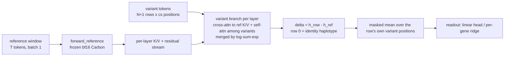

## Question and verdict so far

The question: can fine-tuning Carbon-500M through the variant cache predict cis gene expression from SNPs better than the field default, a per-gene elastic net on genotypes?


## The model

The variant cache runs the frozen reference window once and recomputes only the token positions where any accession differs from the reference. All of it lives in `CARBON_modules/`.



One batch is one gene: the reference window and every accession that differs from it inside the window. Row 0 is always the pure reference, so a row's delta is the model's representation of what that accession's variants changed.

| Piece | Where | What it does |
| --- | --- | --- |
| Cache encoder | `variant_cache_layers.py`, `VariantCacheCarbonEncoder` | `forward_reference` (frozen stream), `_variant_layer` (one decoder layer of the variant branch), optional gradient checkpointing of the variant branch (`variant_checkpointing`) and a `_delta` hook for adapters |
| LoRA | `variant_lora_layers.py`, `VariantLoRACarbonEncoder` | fp32 LoRA adapters on the variant stream only (q, o and the three MLP projections); base stays bf16 and frozen. Overrides `_delta` only. One LoRA, not the reference-plus-variant pair originally imagined |
| Loader | `loader.py`, `load_carbon_variant_lora` | builds the model with r, alpha, dropout; `trainable_parameters` and `checkpoint_state_dict` for adapters |
| Tests | `test_carbon_equivalence.py`, `test_variant_lora.py`, `model_dev/test_carbon_variant_cache.py` | cache output equals the exact full forward; gradients through checkpointing exact (rel err 0.0) |

Cache size (cs) is the union over rows of positions where an accession's 6-mer token differs from reference: about 100 of 1,334 tokens per gene on arabidopsis at TSS ± 4 kb, about 70 on SIEVE. Readout pools over all recomputed positions of a row, never a single probe token, at the user's request. LD pruning is deliberately not used.

## Datasets and targets

Three panels are built; arabidopsis carries almost all the results. All data sits under `/90daydata/small_grains/andrew.dickson/datasets/`.

| Panel | Size | Variants | Target | Splits | Status |
| --- | --- | --- | --- | --- | --- |
| Arabidopsis 1001G | 22,611 genes x 665 accessions | recurring SNPs, pgen | per-gene z of `deviation`, standardized by train-accession stats | random accession split 531/52/82; family gene split 15,817/2,242/4,552; kinship split (below) | main test bed |
| SIEVE (Brachypodium) | 27,914 genes x 796 sodium-azide lines | private induced mutations, about 1 per line per window; `max_ac=5` filter | per-gene z by control-line sd, minus per-line offset from background genes | family gene split; lines | signal exists (gate 0) but about 1 clean observation per gene; deprioritized |
| Kremling maize | 36,748 genes x 284 lines, 7 tissues | 25 M SNPs, AGPv3 | deviation | random line split 199/43/42 | built by the other agent, elastic-net bar done, not wired to `training_ge` |

Three arabidopsis targets are in use, each answering a different confound.

| Target | How | Why |
| --- | --- | --- |
| raw z | standardize `deviation` per gene on train accessions | the plain task |
| kinship residual | subtract train-fitted GBLUP on the genome-wide kinship matrix, lambda 3 (`--kinship-residual`) | removes haplotype matching; conservative, also removes stratified true cis effects. GBLUP alone scores +0.167 on the random split |
| enet residual | additionally subtract a per-gene cis ElasticNetCV fit on train accessions (`--enet-residual`) | what is left is beyond linear reach of genotypes; the elastic net is out-of-sample on val by construction |

The kinship split (`accessions/kin_split` in the h5, made by `ath_kinship_split.py`) holds out whole admixture groups instead of residualizing: val is Italy/Balkan/Caucasus (82 accessions), test is South Sweden (41), 13 related accessions are excluded, 529 train. Val median max-kinship to train falls from 0.17 to 0.05 and GBLUP falls from +0.167 to +0.084, so most but not all relatedness is gone.

Every batch row also carries a `novel` flag: it holds an alt allele at a SNP no train accession carries, which is exactly the set of columns a train-fitted elastic net drops. Val rows are 9 percent novel on the kinship split and 14 percent on the random split.

## Code map

Expression work lives in `training_ge/` (trainer, data sources, controls, evaluators). `model_dev/` holds the earlier go/no-go probes. Everything runs as `python -m training_ge.<module>` from the repo root with the pinned svar interpreter.

| Script | Role | Typical call |
| --- | --- | --- |
| `training_ge/run.py` | the trainer: LoRA through the cache, linear or per-gene head, all holdouts and targets, MetricLogger sidecar, best-val checkpoint | `run.py --dataset ath --holdout accessions --split-key kin_split --n-genes 200 --rows-per-step 64 --lora-r 8 --output $SVAR_SCRATCH/runs/x.pt` |
| `training_ge/ath_data.py` | `ArabidopsisWindowSource`: builds one `GeneBatch` per gene from TAIR10 + pgen; kinship and enet residual targets; `novel` flags; `split_key` | used by run.py, eval_checkpoint.py, controls |
| `training_ge/data.py` | `GeneBatch` dataclass and `SieveWindowSource`; 6-mer id patching (`id6`, verified against the tokenizer at startup) | used by run.py |
| `training_ge/ath_ridge_head.py` | one frozen (or LoRA checkpoint) inference pass caches pooled deltas for all rows, then exact per-gene RidgeCV; `--n-val-genes` switches to the unseen-gene transfer fit | `ath_ridge_head.py --split-key kin_split --features feat.npz [--ckpt x.pt] [--n-val-genes 500]` |
| `training_ge/eval_checkpoint.py` | re-scores a saved checkpoint on all val accessions, with novel vs seen breakdown; loads old and new head formats | `eval_checkpoint.py --ckpt x.pt --kinship-residual --splits val` |
| `training_ge/ath_elasticnet_control.py` | the bar: per-gene ElasticNetCV on cis genotypes, same genes, split and target as the cache; `--enet-residual` fits a second enet on the double residual | `ath_elasticnet_control.py --split-key kin_split --no-kinship-residual` |
| `training_ge/ath_kinship_baseline.py` | GBLUP on the kinship matrix, no sequence: how much the target is predictable from relatedness alone | `ath_kinship_baseline.py` |
| `training_ge/ath_kinship_split.py` | builds and writes the admixture-group holdout split, prints GBLUP calibration on it | `ath_kinship_split.py --write` |
| `training_ge/run_ge.sbatch` | Slurm wrapper; args pass through; first arg `training_ge.<module>` picks another entry point | `sbatch -J name training_ge/run_ge.sbatch [module] args...` |
| `training_ge/run_sieve_full.sbatch` | full SIEVE family-holdout job, never submitted | |
| `model_dev/bench_expression_cache.py` | GPU envelope of cache fine-tuning at expression scale (T, cs, N sweeps) | |
| `model_dev/probe_expression_windows.py`, `probe_kremling_windows.py` | what a cis window looks like: cs/T, dedup, missing calls, per hw | |
| `model_dev/expr_elasticnet_baseline.py`, `kremling_elasticnet_baseline.py` | raw-target elastic-net bars (arabidopsis one superseded by the control above; Kremling one run by the other agent) | |
| `model_dev/sieve_signal_gate.py`, `sieve_dumb_baseline.py` | SIEVE gate 0 (is there cis signal at all) and the pooled-feature dumb baseline | |
| `model_dev/compare_variant_cache_embeddings.py`, `test_carbon_variant_cache.py` | cache vs exact-forward embedding divergence; equivalence tests | |

Trainer flags worth knowing: `--holdout {genes,lines,family,accessions}`, `--split-key {acc_split,kin_split}`, `--kinship-residual`, `--enet-residual`, `--rows-per-step K` (sample K accession rows per gene visit instead of discarding accessions with `--max-lines`), `--per-gene-head` with `--gene-lr` and `--gene-wd`, `--head-only` (frozen adapters), `--exact` (full forward, the approximation control), `--permute` (shuffle targets within gene, the null), `--hap-chunk` (memory staging only).

## Results ledger

All arabidopsis numbers are pooled Pearson r on val pairs, 200 genes at TSS ± 4 kb unless noted, the same seed-42 gene set throughout. Standard errors are about 1/sqrt(n): 0.008 at n = 15,746, 0.010 at n = 10,053, 0.023 at n = 1,971.

### Arabidopsis, kinship split, raw z target (2026-09-18 to 09-23)

The cleanest comparison: no residualization, relatedness removed by the split, every model scored on the identical 15,746 val pairs.

| Model | Val r | Notes |
| --- | --- | --- |
| per-gene elastic net on genotypes | +0.243 | the bar; +0.241 on the kinship-residual target; novel-allele rows +0.262, seen +0.243 |
| per-gene ridge on trained-LoRA features | +0.205 | train in-sample +0.43; novel +0.193, seen +0.206 |
| per-gene ridge on frozen Carbon features | +0.200 | no training at all; novel +0.218, seen +0.198; per-gene median +0.12 |
| shared ridge on trained-LoRA features | +0.173 | |
| LoRA r=8, SGD shared head, epoch 8 | +0.134 | rising every epoch 0.044 to 0.134, not converged; train r 0.23 |
| LoRA r=8, SGD per-gene head (gene-lr 3e-2) | +0.130 | no gain over the shared head |
| shared ridge on frozen features | +0.121 | |
| GBLUP, kinship only | +0.084 | no sequence |
| LoRA r=8 on the enet residual | +0.010 | nothing beyond linear reach |

### Arabidopsis, random accession split, kinship-residual target (2026-09-03 to 09-18)

| Model | Val r | n | Notes |
| --- | --- | --- | --- |
| per-gene elastic net | +0.233 | 10,348 | |
| GBLUP alone (before residualizing) | +0.167 | all genes | the confound the residual removes |
| LoRA r=8, all 531 train accessions, rows-per-step 64 | +0.065 | 10,053 | epoch 1, killed at epoch 2; novel rows +0.026, seen +0.071 |
| LoRA r=1 wd=3, trained on about 100 accessions (`--max-lines 128`) | +0.058 | 10,053 | 5.9 sigma; the original "encouraging" number |
| exact full forward, r=1, 3 epochs | +0.075 | 1,971 | the other agent's approximation control: cache costs nothing measurable |
| head-only, frozen adapters, SGD head | +0.046 | 1,971 | |
| second elastic net on the double residual | +0.022 | 10,348 | linear exhaustion: enet #1 was near CV-optimal |
| LoRA r=1 on the double residual | +0.013 | 10,053 | not significant; the retracted +0.05 (see next section) |

### Ridge regularization sweep, 6 smoke genes, kinship split

The CV-chosen alpha is already the peak on the held-out population; the train-to-val gap is sample-size optimism (0.48 in-sample to 0.36 out-of-fold on train accessions) plus population shift (0.36 to 0.22), not under-regularization.

| Alpha | Train in-sample | Train out-of-fold | Held-out population |
| --- | --- | --- | --- |
| CV choice / 10 | +0.55 | +0.35 | +0.20 |
| CV choice | +0.48 | +0.36 | +0.22 |
| CV choice x 10 | +0.40 | +0.33 | +0.16 |
| CV choice x 100 | +0.32 | +0.26 | +0.12 |

### SIEVE (2026-09-03)

| Check | Result |
| --- | --- |
| gate 0, data-level signal | focus pairs carry +12.5 percent excess z-variance over matched background after line-offset correction, CI +0.05 to +0.25; ceiling about 11 percent of focus-pair variance for any cis model; signal diffuse |
| dumb pooled-feature elastic net | R² 0.002 |
| LoRA r=1 wd=3, held-out genes | val r about +0.02, n = 633, not significant |
| LoRA r=8 | overfits: train R² 0.5, val about 0 |
| effective sample size | about 1 clean observation per gene; 61 percent of SNVs private, 35 percent of records ac > 100 stock heterogeneity, now filtered with `max_ac=5` |

Reference paper for SIEVE: EMPRES (bioRxiv 10.64898/2026.02.27.708524, Zenodo 18236856) used it zero-shot only; within-gene beta 0.38, partial R² 1.3e-4, about correlation 0.011.

### Kremling maize (other agent)

Elastic-net bar on GShoot: per-gene median R² 0.018, mean 0.10, 27.5 percent of genes above 0.2, roughly five times the arabidopsis cis signal. Not yet wired to the cache.

### Compute envelope (2026-09-03)

T = 8,192 tokens, cs = 1,024, N = 32 rows: 12.1 s per step and 43.7 GiB with variant checkpointing, out of memory without. Arabidopsis full-density epoch about 40 to 80 GPU-hours at 4 kb windows, about 780 at 24 kb. The frozen-feature path replaces all of this with one inference pass of about 12 minutes per 200 genes.

## Retractions, pitfalls and lessons

1. **Retracted: "cache signal survives elastic-net subtraction" (commit 61467ed, 2026-09-03).** The +0.05 on the double residual came from a 1,971-pair val subsample plus best-epoch selection, worth about +0.04 of optimism at r near 0.05. Re-scored on all 10,053 val pairs it is +0.013 and not significant. Rule since then: score every checkpoint on all val accessions with `eval_checkpoint.py` before quoting it.
2. **The SGD head never fit.** Every fine-tuning number near +0.06 came from a shared linear head trained by Adam over 200 genes. Train r on those runs was +0.05 to +0.10, so they were not overfitting, they were not fitting. An exact ridge on the same frozen features gives +0.20. The per-gene SGD head has the same problem worse: each gene gets one Adam update per epoch, eight in a run, so the first two per-gene-head jobs were cancelled before they ran and replaced by the closed-form fit.
3. **`--max-lines 128` was a data handicap, not a memory fix.** It discarded about 80 percent of training accessions per gene. Replaced by `--rows-per-step`, which samples rows per gene visit and keeps every accession in play. Andrew rejected `--hap-chunk` for training because it forces full batching on the accession axis.
4. **The novel-allele partition as defined does not separate the models.** A val row with one train-absent allele still carries many seen SNPs, and those carry the elastic net (+0.262 on novel rows, above its overall +0.243). A discriminating version needs rows where novel alleles dominate, or elastic-net residuals scored on novel rows only.
5. **Population shift sets the ceiling on the kinship split.** Ridge out-of-fold r on train accessions is 0.36 against 0.22 on the held-out population; the elastic net pays the same price. Absolute numbers on this split are not comparable to random-split numbers.
6. **SIEVE is too thin per gene for supervised fine-tuning.** About one clean observation per gene once shared stock heterogeneity is filtered; the accession axis is effectively closed there.
7. **Operational.** Plain `python` in a new session lacks h5py: use `/home/andrew.dickson/.conda/envs/svar/bin/python`. Long jobs on the login node die with the session; use `run_ge.sbatch`. Another agent commits to the same branch, so expect a transient `index.lock` and never rewrite history.

## Open questions and what is running now

Unseen-gene test, done 2026-09-23 (Slurm 20733806, `logs/ge_fam_ridge_frozen_20733806.out`): frozen Carbon features for 997 train-family and 500 val-family genes on the kinship split, one shared ridge fit on the train-family genes (train accessions), scored on val-family genes, with a within-gene permuted-target null. Features cached at `$SVAR_SCRATCH/runs/feat_fam_frozen.npz`, so any re-fit is CPU-only.

| Rows scored | n | Pooled r | Permuted null |
| --- | --- | --- | --- |
| val genes x train accessions (unseen genes) | 249,435 | -0.005 | +0.003 |
| val genes x val accessions (unseen both axes) | 39,877 | -0.008 | +0.007 |
| seen genes x val accessions (reference) | 79,460 | +0.057 | |

Train in-sample r of the shared ridge was +0.093 on 494,933 rows (alpha 31.6). The shared readout transfers to unseen genes exactly as well as a permuted target does. On seen genes it reproduces the +0.06 that every SGD shared-head run found, so that number was the shared-head ceiling all along, not an optimization failure.

Decision rule agreed with Andrew beforehand: near the permutation null means the arabidopsis expression program is closed. It is at the null.

Remaining items, listed for the record; none is expected to change the verdict on arabidopsis:

- [ ] Widen the window on frozen features (hw 12 kb or 24 kb): one extraction pass each, elastic-net bar re-run at the same hw on CPU.
- [ ] Stack ridge and elastic net: fit ridge on elastic-net residuals from the cached features to see whether the two are additive at all.
- [ ] A discriminating novel-allele test: rows where train-absent alleles are the majority of carried variants.
- [ ] Cross-dataset zero-shot: arabidopsis-fit readout scored on SIEVE mutants against EMPRES's 0.011.
- [ ] Wire Kremling maize into `training_ge` (about five times the cis signal of arabidopsis).
- [ ] Permute control at scale and the reference-plus-variant dual LoRA that was originally intended.

Deprioritized: full SIEVE family-holdout run (sbatch exists, unsubmitted), PhytoExpr stage 1, any hyperparameter sweep on learning rate or dropout (expected gain tens of percent, not the 4x that was needed before the readout fix, and the readout fix is now in).

## Environment, paths, and how to run

Repo: `~/svar`, branch `main` of `git@github.com:amdson/svar.git`; everything above is committed and pushed as of 2026-09-23. A second agent commits to the same branch.

| What | Where |
| --- | --- |
| interpreter | `/home/andrew.dickson/.conda/envs/svar/bin/python` (plain `python` lacks h5py in new sessions) |
| env | `cd ~/svar && source env.sh` sets `SVAR_SCRATCH=/90daydata/small_grains/andrew.dickson` |
| runs | `$SVAR_SCRATCH/runs/ge_*.{log,metrics.jsonl,pt}`; feature caches `feat_*.npz` |
| Slurm console logs | `~/svar/logs/<jobname>_<jobid>.out` |
| arabidopsis data | `$SVAR_SCRATCH/datasets/arabidopsis/` (`expression/expression_dataset.h5`, `arabidopsis_1001g_final.{pgen,pvar,psam}`, TAIR10 fasta, `expression/baselines/grm.npy`) |
| SIEVE data | `$SVAR_SCRATCH/datasets/brachypodium_sieve/dataset/` |
| Kremling data | `$SVAR_SCRATCH/datasets/maize_kremling/` |
| memory notes | `~/.claude/projects/-home-andrew-dickson/memory/expr-prediction-program.md` |

Launching. Anything over a few minutes goes through Slurm so it survives the session:

```bash
cd ~/svar && source env.sh
sbatch -J ge_x training_ge/run_ge.sbatch --dataset ath --holdout accessions --split-key kin_split \
  --n-genes 200 --max-lines 700 --rows-per-step 64 --epochs 8 --lora-r 8 --output $SVAR_SCRATCH/runs/ge_x.pt
sbatch -J ridge_x training_ge/run_ge.sbatch training_ge.ath_ridge_head --split-key kin_split \
  --features $SVAR_SCRATCH/runs/feat_x.npz
```

Reading out. Training-time val numbers are on all val rows since `--rows-per-step` landed, but older checkpoints were scored on subsamples; re-score any checkpoint you quote with `eval_checkpoint.py --ckpt ... --splits val`, which also prints the novel vs seen split. Ridge results print train in-sample, val, novel, seen and per-gene medians directly. The elastic-net bar for any new split, target or window is `ath_elasticnet_control.py` with matching flags, CPU-only, about 6 minutes per 200 genes.

Commit convention: one commit per landed feature or result, message body states the number and what it showed, trailer `Co-Authored-By: Claude Fable 5.1 <noreply@anthropic.com>`.
